# BlockSikka

> A permissioned blockchain payment and settlement network built with Hyperledger Besu, QBFT, Solidity, FastAPI, PostgreSQL, React, Prometheus, and Grafana.

BlockSikka is a production-oriented blockchain engineering project exploring institutional payments, settlement, treasury controls, security engineering, monitoring, fault tolerance, and disaster recovery on a permissioned Ethereum network.

> **Scope:** BlockSikka is a learning and engineering project. It is not a regulated production banking network, independently audited financial infrastructure, or an industry-certified payment system.

---

## Overview

BlockSikka models a private institutional payment network where registered banks can:

- hold a permissioned USD-like token
- authorize payments using EIP-712 signatures
- submit payments through relayers
- achieve deterministic finality through QBFT
- index blockchain events into PostgreSQL
- batch processed payments for settlement
- mint only against verified reserves
- redeem and burn tokenized value
- reconcile treasury activity
- monitor blockchain and application health
- recover database and validator state from backups

The project focuses not only on the successful transaction path, but also on failure handling, security assumptions, recovery, and automated testing.

---

## Key Features

### Blockchain Network

- Hyperledger Besu
- 4-validator QBFT network
- Chain ID `1337`
- approximately 2-second block period
- permissioned validator topology
- deterministic BFT finality
- validator voting and validator-set changes

### Payments

- EIP-712 typed-data signatures
- relayed payment submission
- nonce-based replay protection
- unique payment IDs
- payment expiration
- active-bank validation
- bounded payment batches
- atomic transaction behavior

### Settlement

- processed-payment verification
- unique settlement enforcement
- duplicate settlement prevention
- bounded settlement batches
- atomic settlement transactions
- PostgreSQL settlement indexing

### Treasury

- simulated fiat deposits
- reserve attestations
- verified reserve accounting
- reserve-backed PrivateUSD minting
- redemption requests
- PrivateUSD burning
- simulated payout lifecycle
- reconciliation and recovery metadata

### Security

- role-based access control
- EIP-712 domain separation
- replay protection
- checks-effects-interactions
- reentrancy protection
- pause controls
- account freezing
- batch limits
- reserve limits
- governance controls
- Slither static analysis
- attack and invariant tests

### Operations

- unified start/status/stop scripts
- Prometheus metrics
- Grafana dashboards
- PostgreSQL monitoring
- indexer monitoring
- alert rules
- backup verification
- disaster recovery
- GitHub Actions CI

---

## Architecture

```mermaid
flowchart LR
    UI[React Dashboard]
    API[FastAPI Backend]
    SIGN[Wallet / EIP-712 Signing]
    RPC[Besu JSON-RPC]

    subgraph QBFT["Hyperledger Besu QBFT Network"]
        V1[Validator 1]
        V2[Validator 2]
        V3[Validator 3]
        V4[Validator 4]
    end

    subgraph CONTRACTS["Smart Contracts"]
        AM[AccessManager]
        BR[BankRegistry]
        USD[PrivateUSD]
        PP[PaymentProcessor]
        SE[SettlementEngine]
        RC[ReserveController]
        GOV[Governance]
    end

    IDX[Blockchain Event Indexer]
    DB[(PostgreSQL)]
    PROM[Prometheus]
    GRAF[Grafana]

    UI --> API
    API --> SIGN
    SIGN --> RPC

    RPC --> V1

    V1 <--> V2
    V2 <--> V3
    V3 <--> V4
    V4 <--> V1

    V1 --> CONTRACTS

    CONTRACTS --> IDX
    IDX --> DB
    DB --> API

    V1 --> PROM
    V2 --> PROM
    V3 --> PROM
    V4 --> PROM
    API --> PROM
    IDX --> PROM
    DB --> PROM

    PROM --> GRAF
```



---

## Payment Lifecycle

A payment moves through a persistent lifecycle:

```text
Prepared
   ↓
Signed
   ↓
Submitted
   ↓
QBFT Finalized
   ↓
Indexed
   ↓
Settled
```

### 1. Prepared

The API validates the requested payment and prepares an EIP-712 payment order.

### 2. Signed

The payer signs the typed payment data.

The signed order includes:

- payer
- recipient
- amount
- nonce
- expiry
- payment ID

### 3. Submitted

The signed payment is relayed to `PaymentProcessor`.

### 4. Finalized

The Besu QBFT validator set reaches consensus and finalizes the transaction.

### 5. Indexed

The event indexer stores the blockchain payment event in PostgreSQL.

### 6. Settled

The payment is included in a `SettlementEngine` batch.

---

## Smart Contracts

| Contract | Responsibility |
|---|---|
| `AccessManager` | Role-based authorization |
| `PrivateUSD` | Permissioned USD-like ERC-20 asset |
| `BankRegistry` | Institutional participant registry |
| `PaymentProcessor` | EIP-712 signed payment execution |
| `SettlementEngine` | Unique settlement batches |
| `ReserveController` | Reserve-backed mint controls |
| `Governance` | Timelock-style governance model |

### Solidity Configuration

```text
Solidity:    0.8.26
EVM target:  London
Framework:   Foundry
Libraries:   OpenZeppelin Contracts
```

---

## EIP-712 Payment Security

The payer signs a structured `PaymentOrder` rather than an arbitrary message.

Security properties include:

- chain-bound signatures
- contract-bound signatures
- explicit payer identity
- explicit recipient
- explicit amount
- strict sequential nonce
- expiration timestamp
- unique payment ID

Before funds move, `PaymentProcessor` validates:

```text
amount
expiry
payment ID
nonce
signature
recovered signer
source bank status
destination bank status
```

The state is updated before the token transfer, following checks-effects-interactions.

---

## Settlement Security

`SettlementEngine` enforces the invariant:

> A payment can be settled at most once.

It rejects:

- unknown payments
- unprocessed payments
- previously settled payments
- reused batch IDs
- empty batches
- oversized batches

---

## Reserve-Backed Treasury

BlockSikka includes a simulated treasury lifecycle:

```text
Fiat Deposit
    ↓
Reserve Attestation
    ↓
Verified Reserve
    ↓
PrivateUSD Mint
    ↓
Payment
    ↓
Settlement
    ↓
Redemption Request
    ↓
PrivateUSD Burn
    ↓
Simulated Fiat Payout
    ↓
Reconciliation
```

`ReserveController` prevents minting above verified reserves.

The fiat layer is intentionally simulated. BlockSikka does not connect to real banking rails.

---

## Testing

BlockSikka uses several complementary testing layers.

### Smart Contracts

Current Foundry regression baseline:

```text
71 passed
0 failed
0 skipped
```

Coverage includes:

- unit tests
- integration tests
- fuzz tests
- stateful invariant tests
- replay attacks
- forged signatures
- malformed signatures
- reentrancy attempts
- bounded-batch behavior

Important invariants include:

```text
PrivateUSD total supply = total minted - total burned
```

and:

```text
A payment can never be settled twice
```

---

## Backend Testing

Current backend regression baseline:

```text
153 passed
```

Tests use a dedicated PostgreSQL database:

```text
blocksikka_test
```

A safety guard prevents pytest from running against the normal development database.

---

## Frontend Testing

Current frontend baseline:

```text
9 test files passed
17 tests passed
ESLint passed
Production build passed
```

Coverage includes:

- payment controls
- payment lifecycle
- public demo restrictions
- treasury views
- treasury movements
- reconciliation history
- request inspection

---

## Real-Network E2E Testing

BlockSikka includes real-network E2E tests:

```text
backend/tests/test_real_network_payment_e2e.py
backend/tests/test_real_network_settlement_e2e.py
```

These tests are opt-in with:

```bash
BLOCKSIKKA_RUN_REAL_E2E=1
```

### Payment E2E

Validated flow:

```text
signed order
→ transaction submission
→ Besu
→ QBFT finality
→ PaymentSubmitted event
→ indexer
→ PostgreSQL
→ API/history verification
→ replay rejection
```

### Settlement E2E

Validated flow:

```text
processed payment
→ settlement submission
→ QBFT finality
→ SettlementBatchCreated event
→ indexer
→ PostgreSQL
→ settlement history
→ duplicate settlement rejection
```

---

## QBFT Failure Testing

### Validator Failure and Quorum Loss

Automated script:

```text
network/scripts/test-qbft-fault-tolerance.sh
```

Validated behavior:

```text
4 / 4 validators
→ blocks advance

3 / 4 validators
→ blocks continue

2 / 4 validators
→ consensus stops

restore 4 / 4
→ consensus recovers
```

---

## RPC Outage Recovery

Automated script:

```text
network/scripts/test-rpc-outage-recovery.sh
```

Validated behavior:

```text
validator1 RPC available
→ validator1 stops
→ primary RPC unavailable
→ validator2 continues the chain
→ validator1 restarts
→ validator1 catches up
→ peer count returns to 0x3
```

The fallback RPC port is discovered dynamically from the Besu container configuration rather than hardcoded.

---

## Validator-Set Governance

Automated script:

```text
network/scripts/test-validator-set-change.sh
```

Validated behavior:

```text
4 validators
→ validators vote validator4 out
→ validator set becomes 3
→ consensus continues
→ validators vote validator4 back in
→ validator set returns to 4
```

The network finishes with:

```text
Validator set: 4
Peer count:    0x3
```

---

## Static Analysis

Slither is used for Solidity static analysis.

Initial baseline:

```text
40 contracts analyzed
102 detectors
8 reported results
```

After hardening:

```text
7 reported results
```

The `unchecked-transfer` finding was fixed by explicitly checking the boolean return value fromhan blindly suppressed.

See:

```text
docs/security/slither-findings.md
```

---

## Monitoring

The monitoring stack includes:

- Prometheus
- Grafana
- Besu metrics
- FastAPI metrics
- indexer metrics
- PostgreSQL metrics

Alert coverage includes:

- validator unavailable
- degraded peer connectivity
- stalled block production
- FastAPI unavailable
- elevated API 5xx responses
- indexer unavailable
- indexer lag
- stale indexer
- PostgreSQL exporter unavailable
- PostgreSQL unavailable

---

## Disaster Recovery

BlockSikka includes verified backup and recovery procedures covering:

- PostgreSQL
- validator identities
- Besu state
- deployment metadata

A fresh recovery verification restored:

```text
15 PostgreSQL public-schema tables
4 validator identities
4 validator state trees
```

Recovered validator identities were checked against the live QBFT validator set.

See:

```text
docs/runbooks/backup-recovery.md
```

---

## CI/CD

GitHub Actions validates:

- Foundry formatting
- Solidity compilation
- Foundry tests
- Python backend tests
- PostgreSQL migrations
- frontend linting
- frontend tests
- frontend production build
- monitoring configuration
- dependency/security checks
- disposable QBFT network generation
- validator health
- chain ID
- block production
- validator set
- peer connectivity
- backend Web3 connectivity

Workflow files:

```text
.github/workflows/ci.yml
.github/workflows/system-ci.yml
```

---

## Technology Stack

### Blockchain

- Hyperledger Besu
- QBFT
- Ethereum JSON-RPC
- Solidity
- Foundry
- OpenZeppelin
- EIP-712

### Backend

- Python
- FastAPI
- Web3.py
- SQLAlchemy
- Alembic
- PostgreSQL

### Frontend

- React
- TypeScript
- Vite
- Vitest
- Testing Library

### Operations

- Docker
- Docker Compose
- Prometheus
- Grafana
- GitHub Actions
- Slither

---

## Repository Structure

```text
sikka/
├── backend/
│   ├── app/
│   ├── scripts/
│   └── tests/
│
├── contracts/
│   ├── src/
│   ├── script/
│   └── test/
│
├── frontend/
│   └── src/
│
├── network/
│   ├── config/
│   ├── keys/
│   ├── scripts/
│   └── docker-compose.portfolio.yml
│
├── ops/
│   ├── backup/
│   └── monitoring/
│
├── deploy/
│   ├── start.sh
│   ├── status.sh
│   └── stop.sh
│
├── docs/
│   ├── security/
│   ├── verification/
│   └── runbooks/
│
└── .github/
    └── workflows/
```

---

## Quick Start

### Requirements

Recommended environment:

```text
WSL2 or Linux
Docker Desktop / Docker Engine
Docker Compose
Foundry
Python 3.11+
Node.js
npm
```

### Start Everything

```bash
cd ~/sikka
./deploy/start.sh
```

### Check Health

```bash
./deploy/status.sh
```

Healthy state should resemble:

```text
Validators         4/4 healthy
Peers              0x3
QBFT set           4 validators

PostgreSQL         RUNNING
FastAPI            HEALTHY
Indexer            RUNNING
Frontend           RUNNING

Prometheus         true
Grafana            true
```

### URLs

```text
Frontend           http://127.0.0.1:5173
API                http://127.0.0.1:8000
Indexer metrics    http://127.0.0.1:9101/metrics
Besu RPC           http://127.0.0.1:8545
```

### Stop Everything

```bash
./deploy/stop.sh
```

---

## Run Tests

### Solidity

```bash
cd ~/sikka/contracts
forge test
```

### Backend

```bash
cd ~/sikka/backend
./scripts/test_safe.sh
```

### Frontend

```bash
cd ~/sikka/frontend
npm run lint
npm test
npm run build
```

---

## Important Documentation

- `docs/architecture.md`
- `docs/threat-model.md`
- `docs/security-assumptions.md`
- `docs/final-gap-analysis.md`
- `docs/monitoring-coverage.md`
- `docs/benchmarks/performance.md`
- `docs/runbooks/backup-recovery.md`
- `docs/runbooks/incident-response.md`
- `docs/security/slither-findings.md`

---

## Engineering Lessons Demonstrated

BlockSikka demonstrates practical experience with:

- permissioned blockchain architecture
- Byzantine fault-tolerant consensus
- Solidity contract development
- Solidity security engineering
- institutional signing flows
- EIP-712
- replay protection
- financial state machines
- backend/API architecture
- event-driven blockchain indexing
- relational persistence
- React transaction lifecycle design
- fuzz testing
- invariant testing
- attack testing
- static analysis
- fault injection
- validator governance
- monitoring
- backup and recovery
- CI/CD
- technical documentation

---

## Production Gap

BlockSikka intentionally does **not** claim to be production banking infrastructure.

A real institutional implementation would additionally require areas such as:

- regulated KYC/AML infrastructure
- sanctions screening
- HSM/KMS-backed key custody
- independent smart-contract audits
- external penetration testing
- formal change-management controls
- enterprise IAM
- organizational segregation of duties
- legally defined governance
- regulatory approval
- real fiat settlement rails
- geographically independent DR infrastructure
- formal SLAs/SLOs
- independent assurance

BlockSikka demonstrates engineering techniques and production-oriented design practices, not regulatory production readiness.

---

## Releases

Stable milestone:

```text
v1.0.0-learning
```

Current final engineering branch:

```text
v1.1-engineering
```

---

## Author

**Zohaib Khalid**

Blockchain / Distributed Systems Engineering Project

GitHub:

https://github.com/Zaibiii12/Sikka

---

## License / Usage

This repository is intended for learning, demonstration, portfolio, and hackathon use.

Do not deploy it as real financial infrastructure without independent security, legal, operational, regulatory, and compliance review.
